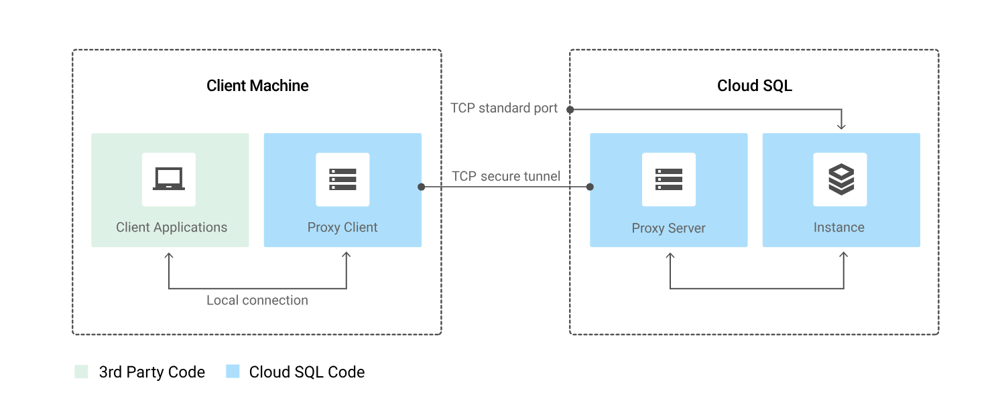

# Proxy de Autenticación CloudSQL para Conexión a la Instancia IMSERSO

## ¿Por qué optar por CloudSQL?

Nuestro grupo ha decidido implementar la base de datos para el proyecto de datos en Google Cloud utilizando el servicio CloudSQL. Esta elección nos permite acceder a la base de datos con permisos a través de una IP pública o utilizando un proxy de autenticación, independientemente de la red a la que estemos conectados.

Los motivos empresariales que respaldan esta decisión se centran en consideraciones de costos. La nube ofrece una forma más segura y económica de implementar nuestra estructura en servidores. Además, este enfoque implica un ejercicio de especialización, ya que los recursos que ya no son necesarios para el mantenimiento de servidores pueden destinarse a tareas de mayor valor añadido en nuestra organización.

## ¿Por qué utilizar un proxy?

Existen varias formas de conectarse a una base de datos en CloudSQL. La primera implica conceder acceso a direcciones IPv4 públicas específicas. Sin embargo, este método presenta un inconveniente: no podemos conectarnos a la base de datos desde diferentes redes sin otorgar los permisos necesarios a cada dirección desde la que queremos trabajar.

El uso de un proxy, por otro lado, nos permite trabajar desde cualquier ubicación sin la necesidad de configurar permisos para direcciones específicas. 

### Instalación en tu máquina/docker:

Para instalar el proxy en tu máquina o entorno Docker, sigue la documentación oficial de Google Cloud sobre el [Proxy de Autenticación](https://cloud.google.com/sql/docs/postgres/connect-auth-proxy?hl=es-419#macos-64-bit).

