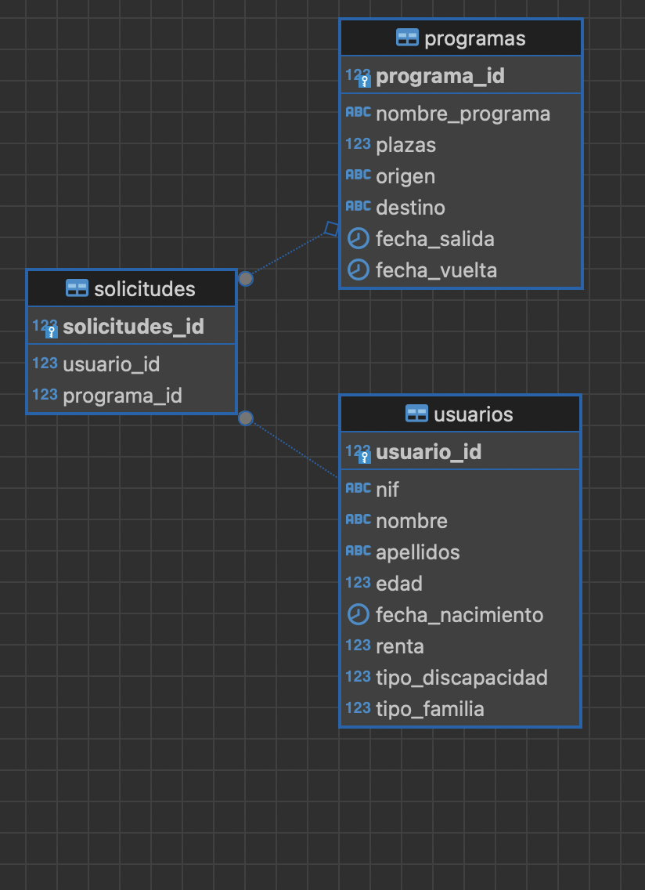
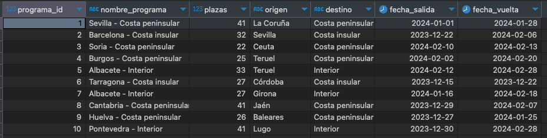
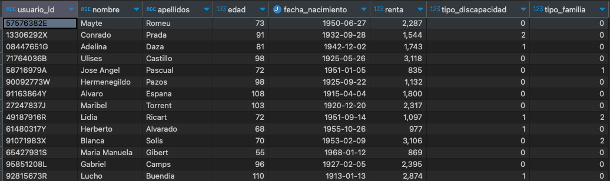
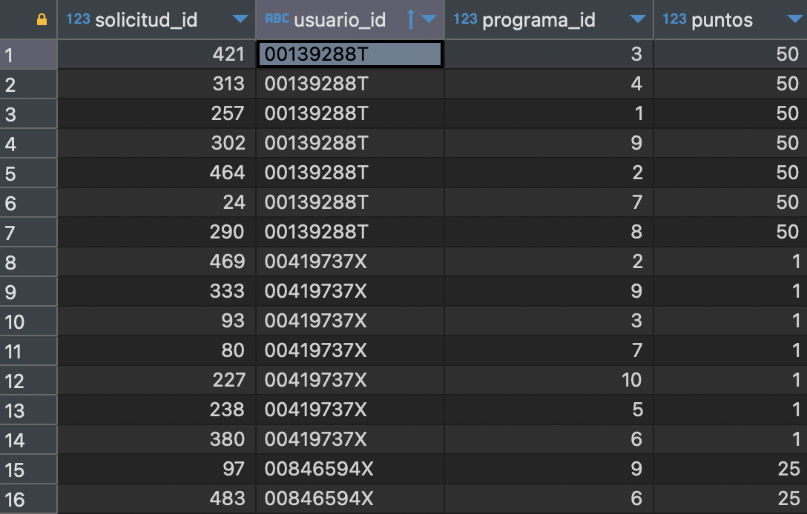
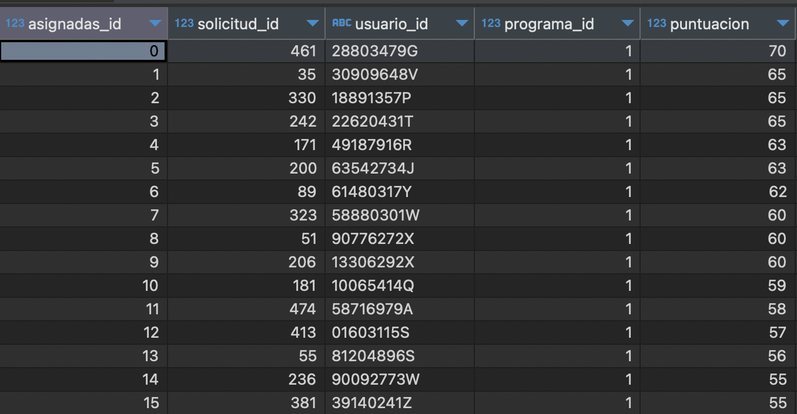
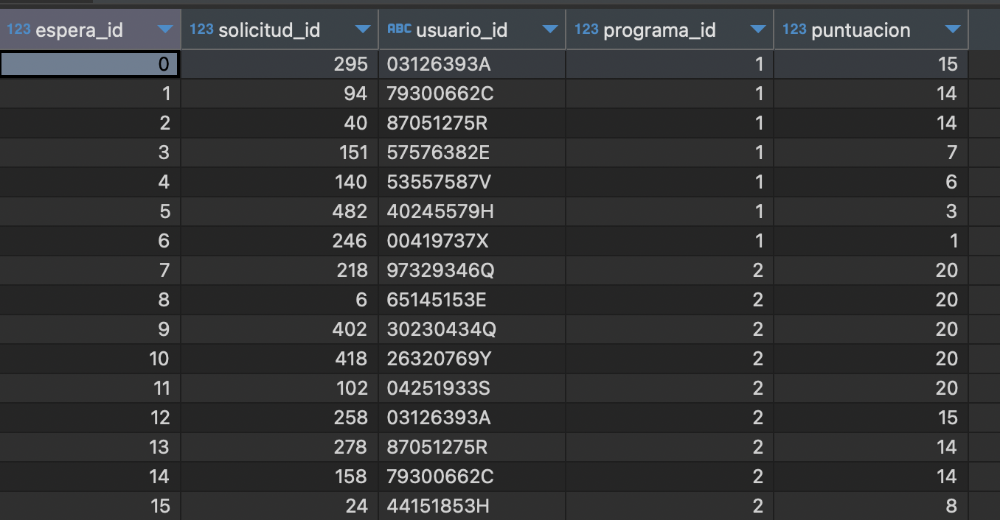
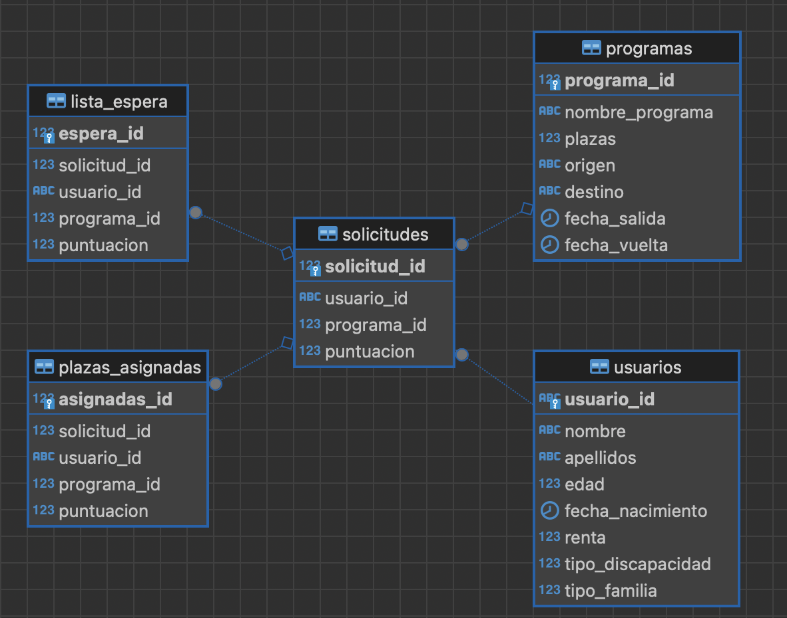
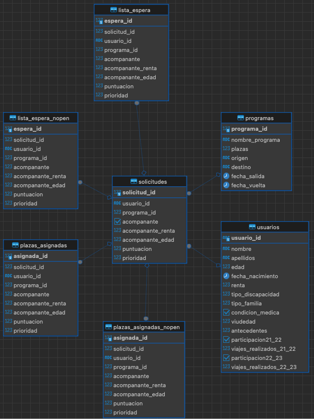

# Proyecto de Asignación de Plazas Hoteleras para el Imserso

Este proyecto tiene como objetivo modernizar el proceso de asignación de plazas hoteleras para el Imserso, a través de la creación de una plataforma eficiente y justa. A continuación, se detallan los pasos y consideraciones clave para el desarrollo de este producto, así como el equipo responsable de su ejecución.

## Objetivo del Proyecto

El Imserso busca agilizar su proceso de asignación de plazas hoteleras, y para ello, hemos sido encomendados con la tarea de diseñar una plataforma que garantice una distribución justa de las mismas. El proyecto no solo consiste en la creación de la plataforma, sino también en la presentación y venta de la solución como si estuviera participando en un concurso público.

## Desarrollo del Producto

### Pasos a Seguir:

1. **Análisis de Requisitos:**
   - Comprender a fondo las necesidades y requisitos del Imserso.
   - Identificar los criterios clave para una asignación justa de plazas hoteleras.

2. **Diseño de la Plataforma:**
   - Desarrollar una interfaz intuitiva y fácil de usar.
   - Implementar algoritmos de asignación que cumplan con los criterios establecidos.

3. **Desarrollo Técnico:**
   - Utilizar tecnologías modernas y robustas para garantizar la eficiencia y la seguridad.
   - Integrar la plataforma con sistemas existentes del Imserso, si es necesario.

4. **Presentación y Venta:**
   - Preparar una propuesta sólida que destaque los beneficios y la innovación de la plataforma.
   - Demostrar la eficacia y la equidad del sistema de asignación.

## Equipo de Desarrollo

Este proyecto está siendo llevado a cabo por un equipo altamente competente, compuesto por:

- Pau Garcia
- Julián Merino
- Toni Faura
- Hugo Fernando Maria Rodriguez
- Paco Tudela

Este readme sirve como guía inicial para el desarrollo del proyecto. ¡Éxito en la creación de una solución innovadora y eficiente para el Imserso!

## Detalles de desarrollo - MVP

- Nos basamos en la siguiente estructura SQL para la MVP
- 

- Fin de MVP: 
  - Procesar usuarios, programas y solicitudes con los criterios actuales de IMSERSO (es decir, sin incluir las nuestras).
  - Generar una puntuación por usuario.
  - Rankear las solicitudes.

- Tabla programas:
  - Contiene programa_id y el resto de características del programa.
  - Dos programas pueden tener idénticas características y diferentes fechas de entrada y/o salida.

-  Tabla solicitudes:
   -  Enlaza usuarios mediante usuario_id y programas mediante programa_id
   -  No contiene fechas, ya que las fechas son únicas para cada programa: un usuario se inscribe en una programa con unas fechas predeterminadas ofrecidas.
   -  En un futuro posterior a MVP se puede considerar enlazar más de un usuario a un programa/solicitud - problemas del futuro.

-  Trabajo inmediato:
   -  Inyectar datos en tabla usuarios (100 basta para probar)
   -  Inyectar datos en tabla programas:
     -  2 programas por región de destino (costa insular, costa peninsular, interior y ya iremos ampliando y definiendo cuando funcione) y origen diferente.
   - Inyectar datos en la tabla solicitudes:
     - Hacer combinaciones de usuario_id y programa_id (que no se repitan, es decir un mismo usuario no puede solicitar lo mismo dos veces)
     - Como idea: cada usuario pida todos los programas una vez, en esta MVP serían 100 usuarios * 6 programas (3 regiones, 2 programas por región) = 600 solicitudes, ¿no?

-  23/12/2023
   -  jumepe: he creado un fichero imserso_jmp.sql nuevo que cambia usuario_id a string y le mete el random de NIF del fichero de generación e inserción de datos gen_datos_simple.py
   -  He cambiado el fichero de generacion e inserción de datos gen_datos_simple.py
   -  He creado un fichero de generación e inserción de datos a la tabla programas gen_datos_programas.py que hace:
      -  Genera 10 programas
      -  programa_id int correlativo de 1-10
      -  nombre_programa con la sintaxis origen - destino
      -  fecha_salida y fecha_vuelta limitado a meses de invierno y fecha_vuelta es posterior a fecha_salida
      -  destino es aleatorio entre tres opciones: Costa insular, Costa peninsular e interior
      -  Todo esto se puede cambiar!
      -  
      -  
-  24/12/2023
   - jumepe: 
     - He ordenado un poco de  la estructura de directorios
     - He creado el script process_usuarios que:
       - Lee la tabla usuarios de la BD y crea un dataframe
       - Añade la columna. 'puntos' al dataframe
       - Evalua tipo de familia, edad, renta y discapacidad y asigna puntos.
       - No evalúa si se ha participado anteriormente en el programa ni si hay más solicitudes para este año (post MVP).
   - Hugo: 
     - crea directorio BBDD y copia archivos necesarios para dockerfile.
   - jumepe: 
     - Pequeña modificación de sql/sql_jmp.sql para añadir la columna puntuacion (mucho problema por tema fkeys al insertar, así va) y cambiar solicitudes_id a solicitud_id
     - He añadido código para generar solicitudes mediante la combinación de usuario_id y programa_id
       - Un usuario_id puede combinar con más de un programa_id, pero no dos veces el mismo.
       - Por cada solicitud, hay una puntuación correspondiente al usuario. Esto en verdad se podría haber hecho con algún query supongo, pero creo que en la tabla será más fácil evaluar las solicitudes. Lo podemos cambiar en el futuro.
       - 
 - 25/12/2023:
     - jumepe: creado código selection_solicitudes.py que evalúa las solicitudes por puntuación, para cada programa_id:
      - Va por cada solicitud para cada programa_id y rankea las solicitudes por puntos.
       - Lee de la tabla programas las plazas que tiene cada programa_id
       - La más alta la mete en un dataframe llamado 'plazas_asignadas' SI quedan plazas
       - Pasa a la siguiente y hace lo mismo, pero si no quedan plazas lo mete en un dataframe 'espera'
       - Cuando ya ha evaluado todo, sube estos dataframes a la base de datos en dos tablas.
       - PROBLEMA A RESOLVER: no es crítico, pero no he conseguido que establezca asignadas_id y espera_id como primary keys...lo miraremos más tarde.
       - 
       - 
       - RESUELTO problema estableciendo asignadas_id y espera_id como primary keys:
         - El problema debe de estar relacionado con cómo sqlalchemy ejecuta el código SQL. Sin embargo, sqlalchemy es necesario para realizar las operaciones con Pandas, así que al final del código vuelvo a conectar a la BD con psycopg2 y el código SQL pasa correctamente.
       - Añadida solicitud_id como foreign keys a lista_espera y plazas_asignadas. Ahora todas las tablas están interconectadas a través de la tabla solicitudes.
       - 
  - 28/12/2023:
     - tumup: 
       - Se añaden los criterios viudedad, participación años anteriores, enfermedad y antecedentes a la tabla gen_datos_v1
       - Se modifica docker y conexión a BBDD en función de los nuevos nombres de los ficheros
       - Se asignan porcentajes mas reales, contrastados con estudios, para las variables enfermedad, viudedad y discapacidad.
       - Se añade lógica para generar usuarios que quedaran en lista de espera en la temporada anterior.
       - Se modifica fichero sql para que la nueva base levante con todos los campos necesarios
       - Se añade lógica en el fichero gen_datos_programas para que los destinos generados sean los destinos reales del imserso
       - Se crean funciones en fichero process_usuario para puntuar los nuevos criterios
 - 29/12/2023
     - jumepe:⁠  ⁠selection_solicitudes con penalty factor
       - Copia la tabla solicitudes a un df_solicitudes y ordena por putuaciones (esto lo podemos cambiar/modificar/etc, no es la parte complicada)
       - ⁠Evalúa la primera entrada, si hay plazas en el programa lo mete (asigna esa entrada al df_asignado), multiplica el resto de entradas para ese usuario_id en el df_solicitudes por un factor de penalización, reordena df_solicitudes por puntuaciones y dropea (borra) esa entrada ya analizada de df_solicitudes
       - ⁠Si no hay plazas, mete esa entrada en df_lista_Espera y dropea la entrada de df_lista_espera
       - ⁠Continúa hasta que todas las solicitudes han sido evaluadas
       - ⁠Inyecta los datos en la BD en las tablas plazas_asignadas y lista_espera y genera sus respectivas primary y foreign keys
 - 31/12/2023:
     - jumepe: modificado SQL para añadir la columna 'prioridad' en solicitudes
     - jumepe: modificado process_usuarios.py:
       - Asigna un número a cada solicitud por combinación usuario_id/programa_id empezando por 1 para la primera combinación e incrementando 1 cada vez que combina.
     - jumepe: modificado selection_solicitudes.py:
       - Cuando lee la tabla solicitudes para pasarla a un dataframe, primero ordena por puntuacion y luego por prioridad
       - Luego si una solicitud es asignada a plazas_asiganadas, aplica la penalización al resto de solicitudes de ese usuario_id y dropea la entrada evaluada
       - Tras dropear la entrada, vuelve a ordenar por puntiacion y prioridad, y vuelve a iterar la siguiente entrada hasta que todas las entradas han sido asignadas.
 - 1/1/2024:
     - jumepe: modificado gen_datos_programas:
       - Fechas de viaje de noviembre a junio.
       - Programas de costa: 8 o 10 días.
       - Programas de interior (circuitos, naturaleza, etc.): de 4 a 6 días.
     - jumepe: modificado SQL:
       - Añade columnas 'acompanante', 'acompanante_renta' y 'acompanante_edad' a la tabla 'solicitudes'
     - jumepe: modificado process_usuarios:
       - Tras leer la tabla usuarios y pasarla a un dataframe:
         - Añade columna 'acompanante' y establece valores aleartorios donde un 25% de las entradas (acomp_factor = 0.25) = True
         - Aquellas entradas con 'acompanante' = True:
           - Asigna valores aleatorios entre 200 y 3000 a la columna 'acompanante_renta'
           - Asigna valores aleatorios entre 18 y 110 a la columna 'acompanante_edad'
           - Recalcula la columna edad (media aritmnética) y renta (suma de ambas dividida entre 1.33)
 - 2/1/2024:
   - Paugb124: modificado gen_datos_v1
     - Edad mínima 55 años y máxima 110. Media entorno a unos 75 años. Asumimos una distribución con sesgo positivo en nuestra base de datos. (cuanto más mayor más dificultad de acceso a las herramientas de solicitud) Elegimos distribución beta con α=2 β=5.
     - También modificado generación datos renta para una distribución de pareto, apropiada para modelar este tipo de eventos. α=3. Regla 80/20 --> el 80% del peso del peso de ingresos lo soporta el 20% de los datos en x.
     - Reparado error decimales de edad truncada en v2.
 - 2/1/2024:
     - jumepe: Cerramos v1, abrimos v2 (tunear, escalar, visualizar)
 - 2/1/2024:
     - tumup: modificado gen_datos_v2:
       - NIF generado ahora es único, la renta debería devolver un valor siempre positivo.
      - Documentación para enfermedades:
        - Basandonos en el informe anual del ministerio de salud del año 20,21 y en los datos obtenidos respecto a enfermedades crónicas y de larga evolución ofrecido por el INE, hemos determinado unos porcentajes que se corresponen en cierta medida con la realidad de las personas majores en España. [Link al informe del ministerio](https://www.sanidad.gob.es/estadEstudios/estadisticas/sisInfSanSNS/tablasEstadisticas/InfAnualSNS2020_21/INFORME_ANUAL_2020_21.pdf) [Link al INE](https://www.ine.es/jaxi/Tabla.htm?path=/t00/mujeres_hombres/tablas_1/l0/&file=d03005.px&L=0)
      - Documentación para discapacidad:
        - Para documentar la discapacidad hemos recurido a varias fuentes, hemos hecho uso de un informe facilitado por el propio Imserso, y de los datos ofrecidos por el INE. [Link al informe del Imserso](https://imserso.es/documents/20123/146998/bdepcd_2022.pdf/390b54fe-e541-3f22-ba1a-8991c5efc88f)[Link al INE](https://www.ine.es/jaxi/Tabla.htm?tpx=51614&L=0)
      - Documentación para viudedad: 
        -  Para documentar la viudedad hemos recurrido a un informe procedente de la Unión Democrática de Pensionistas y Jubilados de España [Link al informe de UDP](https://mayoresudp.org/wp-content/uploads/2014/09/IM-2017-10-JUL-Informe.pdf)
     - Modificación en gen_datos_programas.py
       - Se modifican los programas a 25(total oferrtado), se indica la cantidad generada para cada destino con la información facilitada por el imserso. Para los destinos que no se facilita información y estan englobados dentro de las categorias Viajes Culturales, Turismo Naturaleza y Capitales de provincia se realiza una media del total de las plazas ofertadas y se distribuye entre los destinos de forma equitativa.
       - Se genera función que itere según las plazas disponibles y vaya asignandolas en tandas de 100 hasta que no queden plazas disponibles.
  - 3/1/2024:
     - jumepe: versión de gen_datos_programas.py modificada (gen_datos_programas_jmp.py):
       - Genera tantos programas sean necesarios como plazas disponibles en destino, asignando 100 plazas por programa excepto los últimos, para ajustar a la cantidad final.
       - selection_solicitudes.py: eliminado warning de Pandas línea 73.
   - 3/1/2024
     - tumup: verificamos que nueva versión genera y inserta los programas deseados sin problema y la convertimos en versión principal.
   - 3/1/2024
     - jumepe: prueba a distintos escalados:
       - 1:1: Aprox 2 días (Macbook Air M2)
       - 1:10: Aprox 6 horas (Macbook Air M2)
       - 1:100: Aprox 3 min (Macbook Air M2)
       - 1:50: Aprox 12 min (Macbook Air M2)
         - Vamos adelante con 1:50
       - Añadimos script selection_solicitudes_nopenalty.py para comparar resultados sin penalización por asignación vs penalización (0.75)
       - 
       - Cambiamos scripts selection_solicitudes a condición > 1 en vez de > 0 para evitar romper solicitudes con acompañante.
         - Esto generará programas sin llenar plazas.
   - 4/1/2024
       - jumepe: Ajuste de escalado:
         - Ajustamos escalado para representar el criterio de penalización global (10.000 usuarios, 50.000 solicitudes, 16.000 plazas).
         - Forzamos que los usuarios con edad entre 55 y 60 sean viudos, para poder usar el programa.
       -  tumup: Creamos fichero criterios_justicia.md
  
  # INSTRUCCIONES PARA CORRER EL CÓDIGO
  - Entrar en v2/BBDD
  - Ejecutar docker-compose up -d
  - Comprobar BBDD utilizando DBEAVER u otro cliente de BBDD:
    - DB tipo PostgresSQL
    - host: localhost
    - port: 5432
    - user: postgres
    - pass: Welcome01